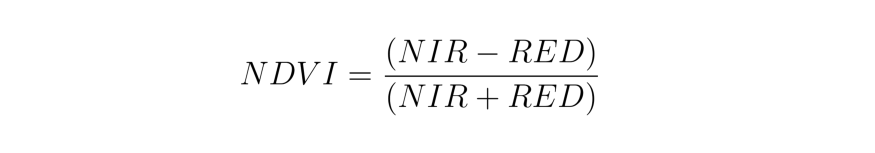

# Calculating Normalized Difference in Python Using EarthPy

This repository shows how to calculate the normalized difference vegetation index (NDVI) using Landsat 5 data. 

 
## Dataset 
Satellite image of the province of Bursa was used for this study.

- Product Type: LANDSAT_5_TM_L1TP
- Sensing Time: 27-JUL-2006 08:38:59.842000

### Test Image

 
 
 ## Normalized Difference Vegetation Index (NDVI)

 

NDVI is used to quantify vegetation greenness and is useful in understanding vegetation density and assessing changes in plant health. NDVI is calculated as a ratio between the red (R) and near infrared (NIR) values.

- In Landsat 4-7, NDVI = (Band 4 – Band 3) / (Band 4 + Band 3).

## Libraries 
The following libraries were used while writing the Python code;

 - Earthpy
 - Rasterio
 - Numpy
 - Matplotlib

## Output Image
  

