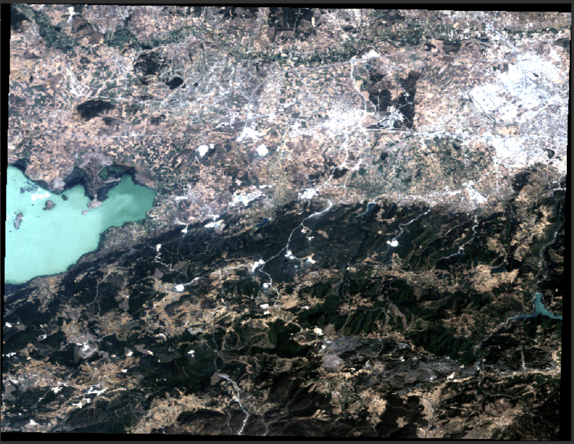
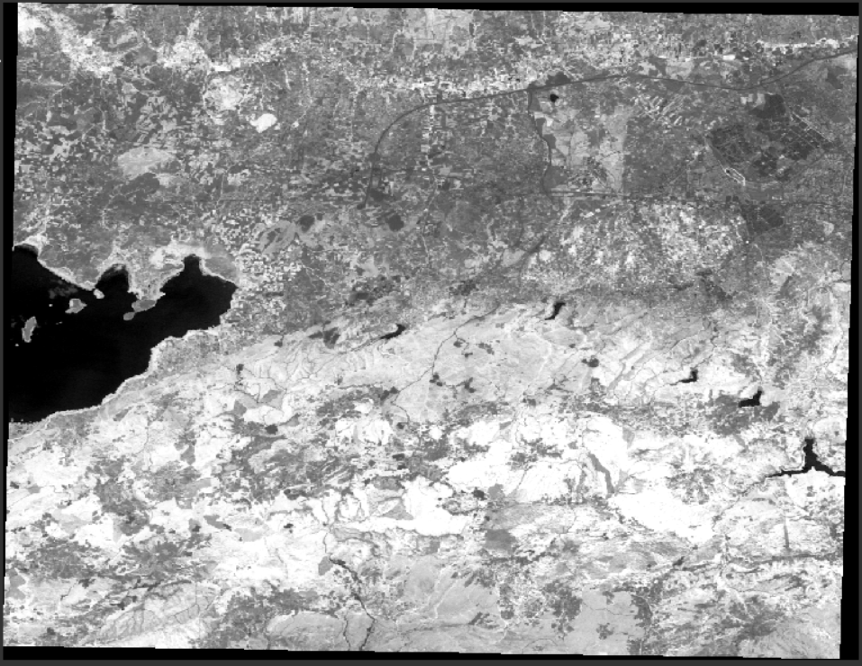

# Calculating Normalized Difference in Python Using EarthPy

This repository shows how to calculate the normalized difference vegetation index (NDVI) using Landsat 5 data
## Dataset 
Product Type: LANDSAT_5_TM_L1TP
Sensing Time: 27-JUL-2006 08:38:59.842000
## Libraries 
 - Earthpy
 - Rasterio
 - Numpy
 - Matplotlib
## Test Image
- 

## Normalized Difference Vegetation Index (NDVI)

- 

## Output Image
 - 

