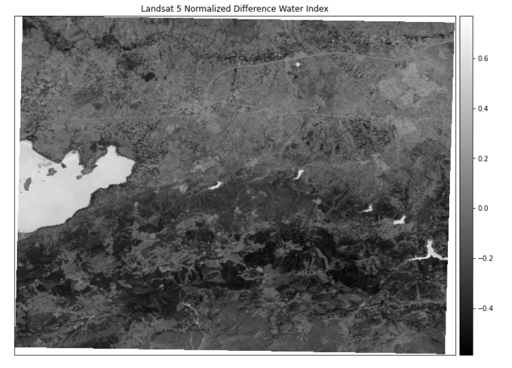

# Calculating Normalized Difference in Python Using EarthPy

This repository shows how to calculate the normalized difference vegetation index (NDVI) using Landsat 5 data. 


 
## Dataset 
Satellite image of the province of Bursa was used for this study.

- Product Type: LANDSAT_5_TM_L1TP
- Sensing Time: 27-JUL-2006 08:38:59.842000

### Test Image


 
  
## Libraries 
The following libraries were used while writing the Python code;

 - Earthpy
 - Rasterio
 - Numpy
 - Matplotlib
 
 Landsat 5 input image (a tiff file) call with related library. Then,  names of bands assign from test image as red and nir. With
 
```Python  ndvi = es.normalized_diff(nir, red)``` 

code, the process continue.
 
 ## Normalized Difference Vegetation Index (NDVI)

 

NDVI is used to quantify vegetation greenness and is useful in understanding vegetation density and assessing changes in plant health. NDVI is calculated as a ratio between the red (R) and near infrared (NIR) values.

- In Landsat 4-7, NDVI = (Band 4 – Band 3) / (Band 4 + Band 3).

After display settings, output as shown:



## Output Image

At this stage, the output image call with this code as a single band
 
```Python 
   meta = image.profile
meta.update(driver='GTiff')
meta.update(count= 1)

with rasterio.open('NDVI.tif', 'w', **meta) as file:
      file.write(ndvi, 1)
      file.close()
```

If the created tiff file is opened with the help of the software, the following image is obtained:

 
 
Analysis can be made about the vegetation with the resulting image. In this image, the waters appear as dark, vegetation appear as bright areas.
