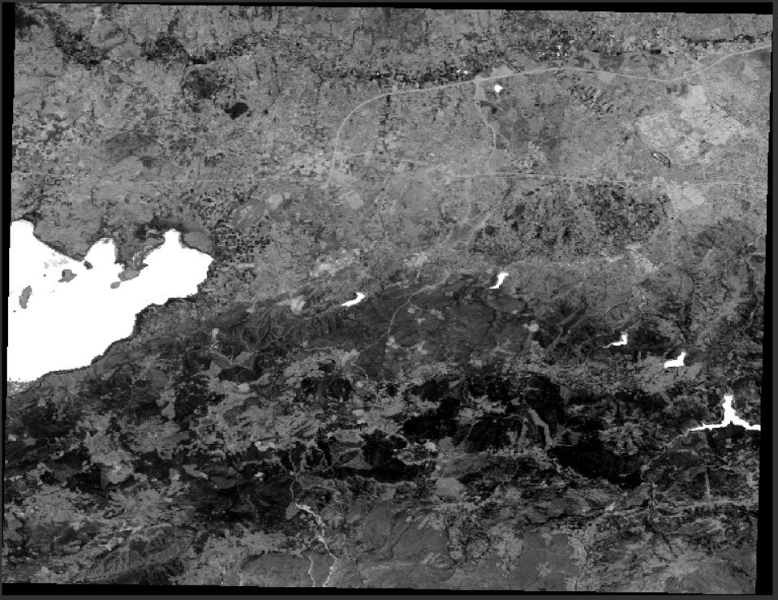

# Calculating Normalized Difference in Python Using EarthPy

This repository shows how to calculate the Normalized Difference Water Index (NDWI) using Landsat 5 data. 


 
## Dataset 
Satellite image of the province of Bursa was used for this study.

- Product Type: LANDSAT_5_TM_L1TP
- Sensing Time: 27-JUL-2006 08:38:59.842000

### Test Image


 
  
## Libraries 
The following libraries were used while writing the Python code;

 - Earthpy
 - Rasterio
 - Numpy
 - Matplotlib
 
 Landsat 5 input image (a tiff file) call with related library. Then,  names of bands assign from test image as green and nir. With
 
```Python  ndvi = es.normalized_diff(green, nir)``` 

code, the process continue.
 
 ## Normalized Difference Water Index (NDWI)

 
 
NDWI is used to monitor changes in water content in water bodies. As water bodies absorb light strongly in the visible infrared electromagnetic spectrum, NDWI uses green and near infrared bands to highlight water bodies. The index was proposed by 1996 McFeeters.

- In Landsat 5, NDVI = (Band 2 – Band 4) / (Band 2 + Band 4).

After display settings, output as shown:


## Output Image

At this stage, the output image call with this code as a single band
 
```Python 
   meta = image.profile
meta.update(driver='GTiff')
meta.update(count= 1)

with rasterio.open('NDWI.tif', 'w', **meta) as file:
      file.write(ndvi, 1)
      file.close()
```

If the created tiff file is opened with the help of the software, the following image is obtained:

 
 
Analysis can be made about the water with the resulting image. In this image, the waters appear as bright, other areas appear as dark areas.
